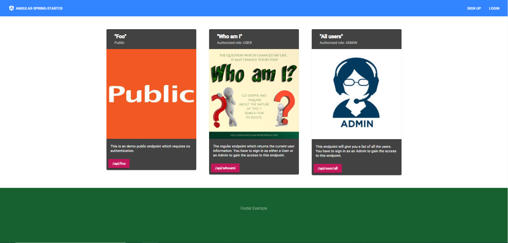
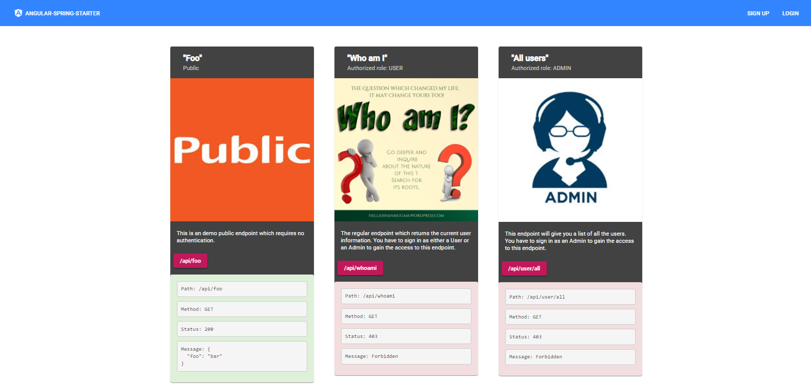
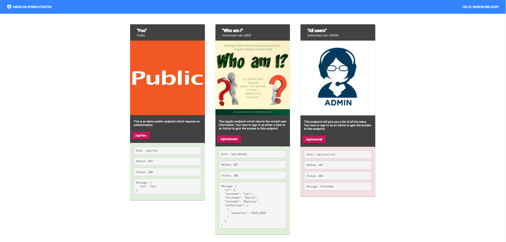
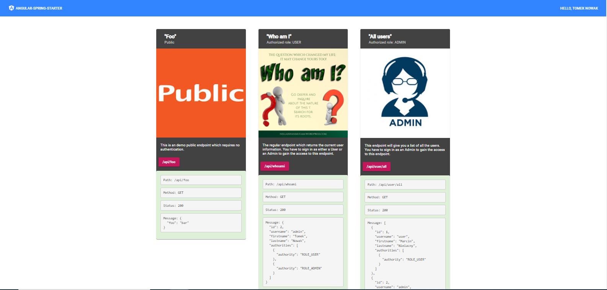
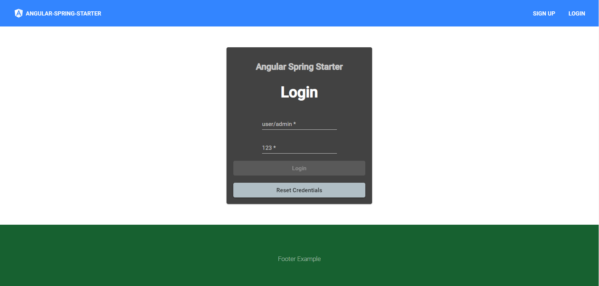
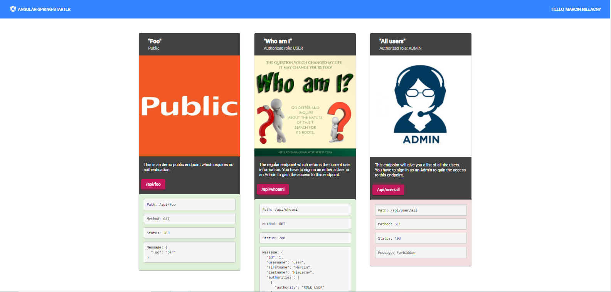

# Spring Security

Project inspired by work found on the internet. It was used to practice skills related to spring security. The project was composed of Angular, Spring and MySQL Workbench.

The project was divided into three phases of file access:
-public
-appropriate user
-admin

The main layout looks like this:

The user without logging in has access only to the first tab:

The logged in user has access to the first and second tabs:

The board presents information about who is currently logged in.

A logged in admin has access to all tabs:

The table presents information about all users saved in the database.

The login panel looks like this:

In the event of lack of rights, we will receive feedback(login as a user to admin panel):

------------------------------------------------------------------------------

Run angular part in main catalog:

1.npm install
2.npm start

Run spring part in main catalog:

1.mvn install
2.mvn spring-boot:run

Test accounts have been added:
1.login: admin password:123 //admin 
2 login: user password:123 //user 
